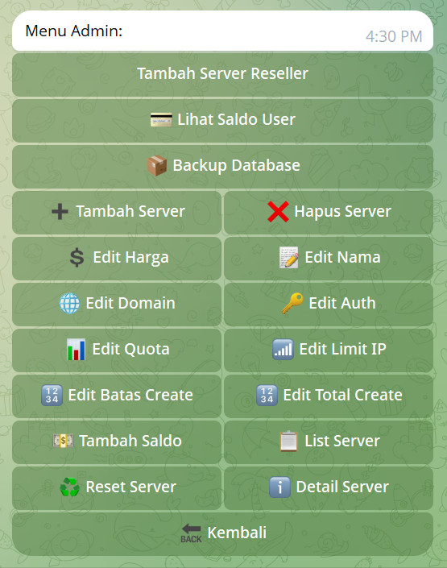

#BotVPN edited from https://github.com/arivpnstores
#Tampilan Menu Bot


#Tampilan Menu Admin


#Update pada bot
#>Menambahkan fitur tambah server khusus reseller (Selain reseller tidak bisa melihat server khusus tersebut)
#>Menambahkan fitur lihat saldo user dengan mengetikan ID telegram user
#Mengganti menu addsaldo, jadi bisa menambahkan saldo user manual dengan memasukan id user 
#>Menambahkan fitur backup database (sellvpn.db)

## DATA QRIS DI DAPAT KAN DARI FOTO QRIS ORDER KUOTA
https://qreader.online/

## CEK PEMBAYARAN 
EDIT FILE DI api-cekpayment-orkut.js
TUTORIAL AMBIL API CEK PEMBAYARAN VIA VIDIO : https://drive.google.com/file/d/1ugR_N5gEtcLx8TDsf7ecTFqYY3zrlHn-/view?usp=drivesdk
```bash
data senif ambil username dan auth_token saja

// api-cekpayment-orkut.js
const qs = require('qs');

// Function agar tetap kompatibel dengan app.js
function buildPayload() {
  return qs.stringify({
    'username': 'yantoxxx',
    'token': '1342xxxx:149:i3NBVaZqHjEYnvuImxWKACgxxxxx',
    'jenis': 'masuk'
  });
}

// Header tetap sama agar tidak error di app.js
const headers = {
  'Content-Type': 'application/x-www-form-urlencoded',
  'Accept-Encoding': 'gzip',
  'User-Agent': 'okhttp/4.12.0'
};

// URL baru sesuai curl-mu
const API_URL = 'https://orkutapi.andyyuda41.workers.dev/api/qris-history';

// Ekspor agar app.js tetap bisa require dengan struktur lama
module.exports = { buildPayload, headers, API_URL };
```
ganti txt hasil seniff anda

